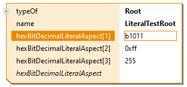

# ch.actifsource.example.selector
In this project we will show to use a literal.

Example literal:

## Requirements
Actifsource  Workbench Community Edition

## License
[http://www.actifsource.com/company/license](http://www.actifsource.com/company/license)
